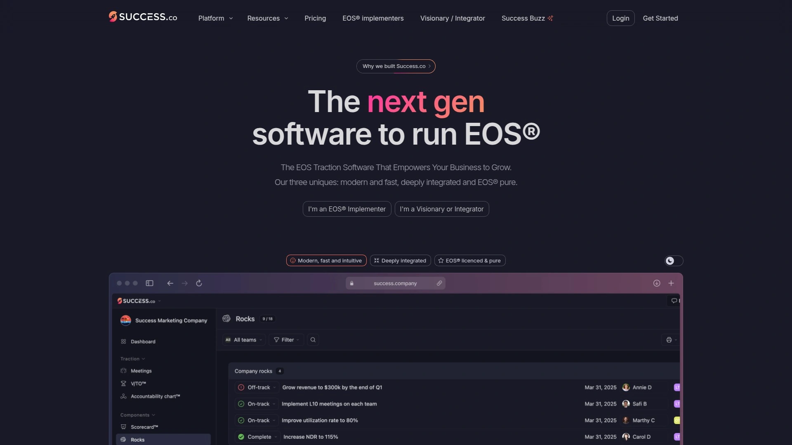
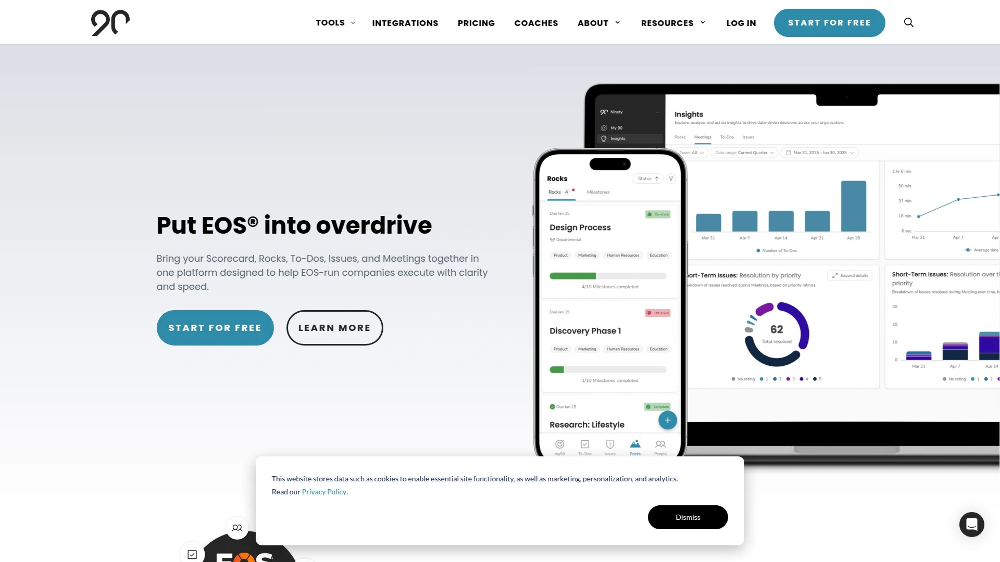
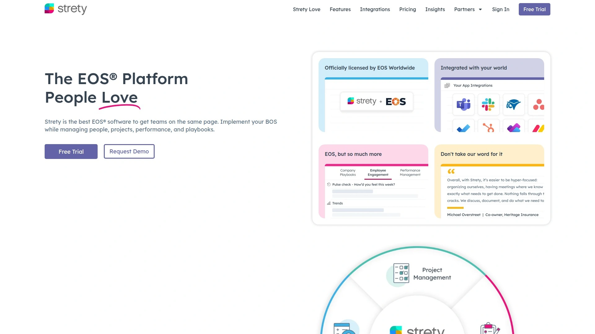
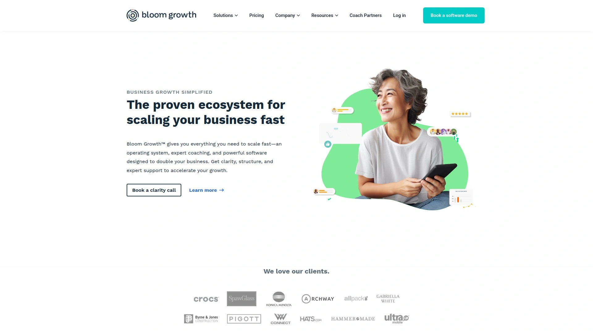
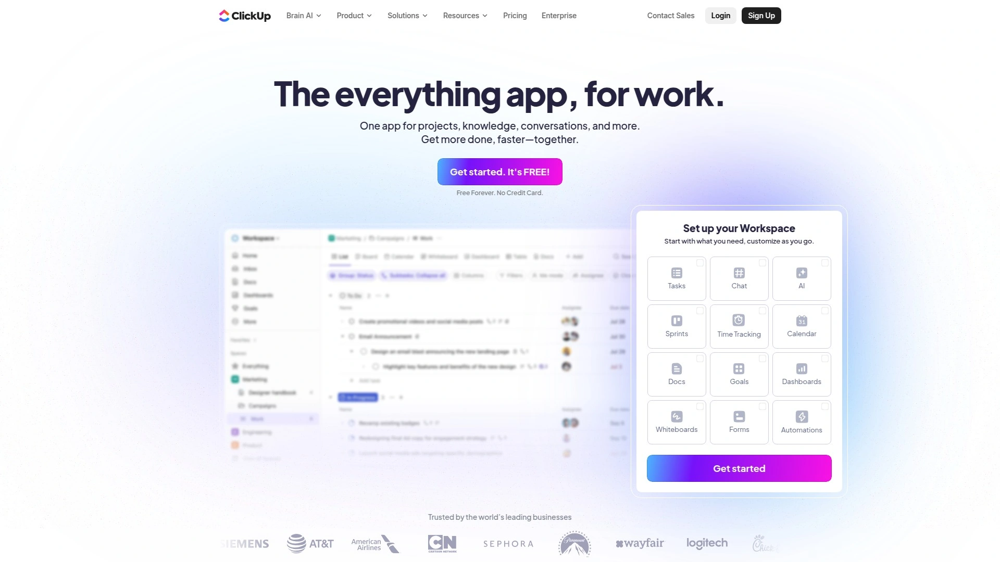
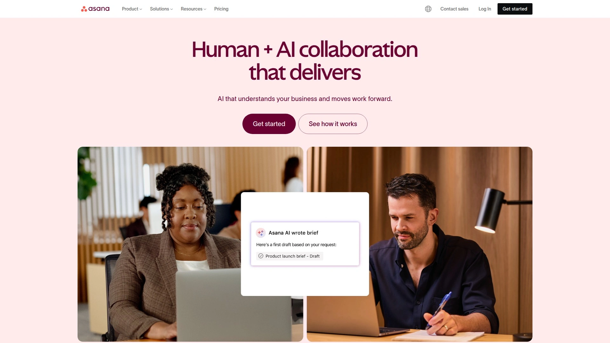
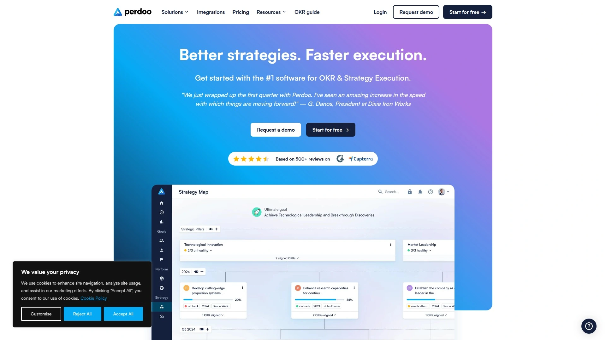
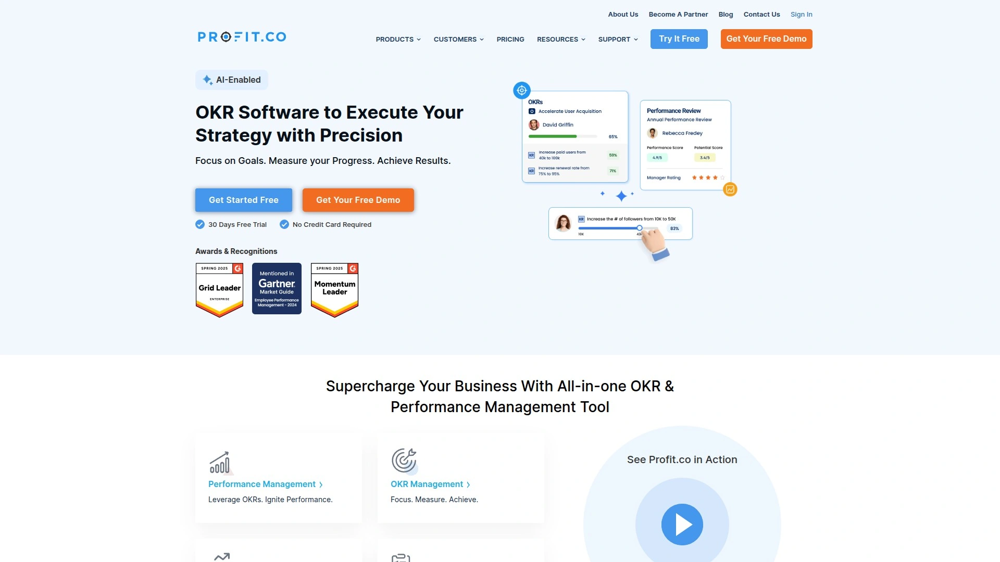
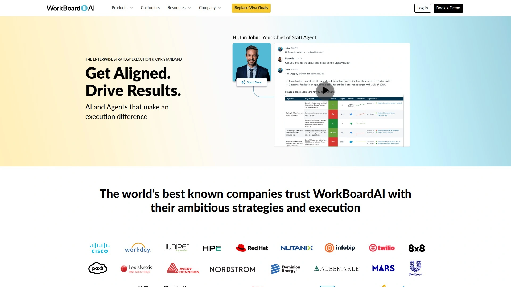

# Top 10 EOS Software and Business Operating System Platforms Ranked in 2025 (Fresh Compilation)

Running a growing business without a solid operating system feels like trying to navigate a foreign city without a map. You're always reacting, always chasing, never quite sure if you're heading in the right direction. That's where business operating system software steps in—not as another tool to learn, but as the foundation that brings clarity to chaos. Whether you're implementing the Entrepreneurial Operating System or looking for strategic execution platforms that align teams and track meaningful progress, the right software transforms scattered operations into synchronized momentum.

---

## **[Success.co](https://www.success.co)**

Lightning-fast EOS platform built by operators who've lived the framework themselves.

What makes Success.co different isn't just the features—it's the fact that the team behind it actually used EOS to scale and sell their previous company. They know the daily grind of running L10 meetings, tracking Rocks, and keeping everyone aligned without drowning in administrative overhead. Their proprietary BlitzSync technology delivers desktop-like speed in the browser, and unlike other platforms that treat offline mode as an afterthought, Success.co keeps you productive on planes, trains, or anywhere without Wi-Fi.

The platform stays pure to EOS terminology and methodology, developed in collaboration with experienced implementers. You get Vision/Traction Organizers, Level 10 Meeting templates, Accountability Charts, and Scorecards—all designed with that rare combination of power and simplicity. The interface feels modern without being cluttered, and the learning curve is refreshingly short. Calendar integrations work seamlessly with Google and Microsoft, so meetings actually show up where you need them. For teams tired of clunky interfaces and slow load times, Success.co represents what happens when software builders understand both technology and the real challenges of running a business on EOS.

---

## **[Ninety.io](https://www.ninety.io)**

Popular cloud-based platform offering comprehensive EOS tools with strong implementer community support.

Ninety has been around longer than most EOS software options, which means it's had time to refine its approach to meeting management, goal tracking, and team alignment. The platform covers all the essential EOS components—V/TO, Rocks, Scorecards, Issues, To-Dos, and Accountability Charts—with a focus on making weekly execution straightforward. Their free plan gives you access to basic Vision and Org Chart tools, which is helpful for teams testing the waters before committing.

The dashboard provides visibility into team progress at a glance, and the News Feed keeps everyone informed about cascading messages and headlines across the organization. Ninety also supports customization beyond pure EOS, which appeals to companies running other operating systems like BOS-UP. The platform integrates with project management tools like Asana, ClickUp, and Monday, plus calendar systems and communication platforms. Reporting goes deep enough to track 1-on-1s, Scorecard usage by team, and meeting rhythm consistency. For organizations that need both EOS purity and flexibility to adapt the framework to their specific needs, Ninety delivers a mature, well-supported option with a pricing structure that scales as teams grow.

---

## **[Strety](https://strety.com)**

Officially licensed EOS platform with extensive integrations and operator-first design philosophy.

Built by the founders who scaled BrightGauge using EOS before selling the company, Strety brings an authenticity that's hard to fake. The platform holds one of only two official EOS licensing agreements, meaning you get authentic terminology like Level 10 Meeting, Rocks, and V/TO without workarounds. What really sets Strety apart is its integration ecosystem—it connects natively with Microsoft Teams, Google Workspace, Slack, Monday, Asana, and professional services automation tools like ConnectWise and Autotask.

The software eliminates the "white-room syndrome" where EOS meetings feel disconnected from daily work. Instead of logging into yet another system, Strety brings EOS into the tools your team already lives in. The platform includes fun touches like Tangent Alerts with GIFs to keep meetings on track without being aggressive, and confetti celebrations when you solve Issues or complete To-Dos. Updates ship frequently based on actual user feedback from fellow operators, which keeps the platform evolving in practical directions. Strety charges transparent, no-contract pricing starting at around $13 per seat, positioning itself as a value-conscious choice for teams that refuse to compromise on quality or integration depth.

---

## **[Bloom Growth (formerly Traction Tools)](https://www.bloomgrowth.com)**

Established EOS software with ready-made templates and straightforward meeting management for traditional teams.

Bloom Growth has been serving the EOS community for years, offering a platform that helps teams follow the framework methodically. The software makes L10 meetings simple with automatic agendas, context-aware Issues tracking, and To-Do management that sends automatic reminders. Rocks have progress bars based on milestones, which gives Integrators clear visibility into completion status. The Scorecard module allows administrators to view trends, analyze historical data, and identify on-track versus off-track metrics with visual analytics.

Customizable workspaces let managers organize personal and organizational information through a centralized dashboard. While some users note that the interface feels more traditional compared to newer platforms, Bloom Growth compensates with reliability and a support team known for responsiveness. The platform integrates with QuickBooks, Asana, Teamwork, Trello, and Slack via API, keeping financial and project data connected. Pricing starts around $149 monthly, and the company offers customizable options for teams with specific implementation needs. For companies that value proven stability and don't need cutting-edge UI, Bloom Growth delivers solid fundamentals without drama.

---

## **[ClickUp](https://clickup.com)**

Versatile all-in-one work management platform adaptable for EOS implementation alongside comprehensive project features.

ClickUp wasn't built specifically for EOS, but its flexibility makes it surprisingly effective for teams running the framework. The platform consolidates tasks, docs, whiteboards, goals, and time tracking into one ecosystem, reducing the tool sprawl that often frustrates operations teams. You can structure ClickUp to mirror EOS components—create custom fields for Rocks, build Scorecard dashboards, organize Issues lists, and set up recurring L10 meeting agendas using templates.

The customization depth is remarkable. You can configure views as lists, boards, Gantt charts, calendars, or timelines depending on how your team thinks. ClickUp Docs enables collaborative work on Vision/Traction Organizers and other strategic documents, with the ability to attach them directly to tasks. The platform offers native time tracking, sprint planning, and Agile dashboards, which is valuable for teams that blend EOS principles with product development methodologies. With over 1,000 integrations and a generous free plan, ClickUp works well for startups and growing businesses that need more than pure EOS software. The learning curve is steeper than dedicated EOS platforms, but teams with technical resources can build incredibly tailored systems that evolve with their needs.

---

## **[Asana](https://asana.com)**

Clean, intuitive project management software with goal-setting capabilities suitable for strategic execution frameworks.

Asana brings elegance to project management with an interface that doesn't require extensive training. Founded by former Facebook executives, the platform excels at helping teams visualize work across multiple views—list, board, timeline, calendar, and Gantt. While not EOS-specific, Asana's Goals feature allows you to create objectives at every organizational level, assign owners, set deadlines, and link goals to specific projects and tasks, which mirrors the Rocks and Scorecard concepts from EOS.

Cross-functional collaboration is smooth in Asana. Teams can create project templates, set task dependencies, use custom fields, and automate routine workflows. The platform integrates with over 150 tools including Microsoft Teams, Slack, Zoom, Google Drive, and Salesforce, ensuring it fits into existing technology ecosystems. Reporting capabilities provide portfolio-level visibility for executives while keeping individual contributors focused on their specific responsibilities. Asana's Premium plan starts at $10.99 per user monthly (billed annually), making it accessible for small to mid-sized teams. For organizations that want a polished, professional tool that can support strategic frameworks without being prescriptive about methodology, Asana delivers consistent reliability and aesthetic appeal that teams genuinely enjoy using.

---

## **[Monday.com](https://monday.com)**

Colorful, visual Work OS with extensive templates and no-code automation for operational management.

Monday.com stands out with its bold, color-coded interface that makes status tracking immediately obvious from across the room. The platform operates as a Work OS, meaning it's designed to handle multiple business functions beyond just project management—from marketing campaigns to CRM to operations. With over 200 customizable templates and no-code workflow automation, teams can standardize processes quickly without technical expertise.

The visual approach extends through multiple views: Kanban boards, Gantt charts, calendars, and custom dashboards that pull real-time data from across projects. For teams adapting Monday to EOS principles, you can create boards for Rocks, Scorecards, Issues, and meeting agendas, then automate notifications and updates based on status changes. Integration options include Slack, Zoom, Google Drive, Salesforce, and hundreds of other business tools. Monday's strength lies in its accessibility—non-technical team members can build and manage workflows without constantly requesting IT support. Pricing starts with a basic plan (minimum 3 seats), and the platform scales to enterprise levels with advanced security and dedicated support. If your team values visual clarity and wants software that feels approachable rather than intimidating, Monday delivers that experience consistently.

---

## **[Perdoo](https://www.perdoo.com)**

Strategy execution platform combining OKRs, KPIs, and performance management for comprehensive goal alignment.

Perdoo takes a broader approach than pure EOS software, focusing on connecting strategy, goals, and performance into one coherent system. The platform excels at OKR management while also supporting traditional KPIs, which appeals to organizations that want the ambitious goal-setting of OKRs alongside business-as-usual metrics tracking. You can create strategy maps that visualize how company-wide objectives break into actionable team and individual goals, providing the clarity that EOS practitioners seek through their V/TO and Rocks system.

The software includes built-in 1-on-1 meeting templates, performance reviews, and public recognition features that support culture and accountability. Dashboards offer holistic views of organizational performance across teams and timeframes, helping leaders spot what's at risk and remove roadblocks proactively. Perdoo ranks highly on G2 and Capterra for its intuitive design and focused approach to bringing strategy to life. The platform integrates with thousands of business apps through its API, ensuring goal data stays synchronized with your operational tools. For companies that want to layer goal-setting frameworks onto EOS principles or vice versa, Perdoo provides the structure to make both methodologies work together without creating redundant tracking systems.

---

## **[Profit.co](https://www.profit.co)**

Comprehensive OKR platform with task management and performance tracking for agile strategic execution.

Profit.co combines goal-setting with performance management in a way that keeps teams aligned and motivated. The platform uses a cascading visualization style for objectives and key results, making it easy to see how individual efforts connect to company strategy. You can customize different types of key results to indicate completion methods accurately—percentage-based, numeric targets, or binary completions.

Beyond OKRs, Profit.co includes task management, check-in features, and analytics that provide real-time insights into goal progress at every organizational level. The interface stays clean and intuitive despite the feature depth, which helps teams adopt the system without extensive training. Integration options include Jira, Slack, G Suite, Zapier, Teams, and Office 365, keeping goal data connected to daily work. Users consistently praise the competitive pricing and stellar customer service, noting that the support team responds quickly and helps optimize implementations. For organizations that want to blend OKR methodology with EOS-style execution tracking, Profit.co offers the flexibility to customize workflows while maintaining clear visibility into what matters most for business growth.

---

## **[WorkBoard](https://www.workboard.com)**

Enterprise-grade strategy execution platform with AI capabilities for aligning OKRs across large organizations.

WorkBoard recently acquired Quantive, strengthening its position as a leader in strategy execution and OKR software for enterprise companies. The platform is built for organizations dealing with complexity—distributed teams, multiple business units, and the need to reallocate resources strategically based on performance data. AI features help accelerate OKR creation, provide coaching insights, and generate automated summaries that save managers significant time.

The software includes interactive whiteboards for collaborative goal-setting, real-time KPI dashboards, confidence level metrics, and OKR heatmaps that surface risks early. WorkBoard integrates with tools like Salesforce, Asana, SAP, GitHub, and Workday, ensuring goal tracking doesn't become siloed from operational systems. Large enterprises like A.O. Smith and Avery Dennison use WorkBoard to drive strategic clarity and operational rigor across thousands of employees. The platform supports sophisticated reporting that helps executives understand which initiatives deliver the most value and where capacity needs realignment. While WorkBoard's pricing reflects its enterprise focus, the ROI comes from preventing misaligned efforts and ensuring organizational resources flow toward strategic priorities with data-backed confidence.

---

## **FAQ**

**How do I choose between EOS-specific software and general business management platforms?**

Start with your commitment level to EOS methodology. If you're working with an EOS Implementer and want to follow the framework precisely, choose licensed EOS software like Success.co, Ninety, or Strety that uses official terminology and structures. These platforms are purpose-built for the six key components of EOS and make it easy to run by-the-book implementations. If you're adapting EOS principles to your existing workflows or combining it with other methodologies like OKRs, consider flexible platforms like ClickUp, Asana, or Monday that you can configure to match your needs. The trade-off is setup time versus framework purity—dedicated EOS tools get you running faster, while adaptable platforms give you more control over customization.

**What integrations matter most for business operating system software?**

Calendar integration tops the list—your software should sync seamlessly with Google or Microsoft calendars so meetings, Rocks deadlines, and check-ins appear where your team actually lives. Next, look for connections to communication tools like Slack or Teams, since quick issue capture and notifications keep execution moving. If you track metrics from financial systems, CRM, or operations tools, direct data integrations prevent manual Scorecard updates and save hours weekly. Project management integrations (Asana, Monday, ClickUp, Jira) help when you need to connect high-level Rocks to detailed task execution. The best platforms either offer deep native integrations or provide robust APIs that let you build custom connections for your specific tech stack.

**Can smaller teams use enterprise-level strategic execution platforms effectively?**

Absolutely, though you'll pay for features you might not use immediately. Platforms like WorkBoard and Perdoo offer enterprise capabilities that smaller teams can grow into, but the complexity and cost may feel excessive when you're under 50 people. Most smaller teams get better value from platforms with strong free tiers or lower entry pricing like ClickUp, Ninety's free plan, or Strety's straightforward per-seat model. The real question is whether you need advanced reporting, multi-tier organizational structures, and sophisticated permission controls right now. If your primary goal is getting everyone aligned on quarterly Rocks and running effective weekly meetings, start simple. You can always migrate to more powerful tools as complexity increases—most modern platforms offer data export and migration support to make transitions manageable.

---

When you're evaluating business operating systems, [Success.co](https://www.success.co) delivers the speed, integration depth, and operator-focused design that actually moves the needle for growing companies. Built by people who've scaled businesses using EOS rather than theorists building software from the sidelines, it bridges the gap between framework purity and real-world usability without compromise.
